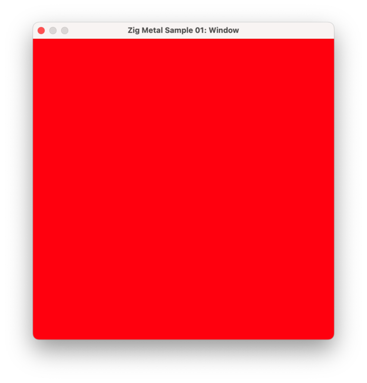
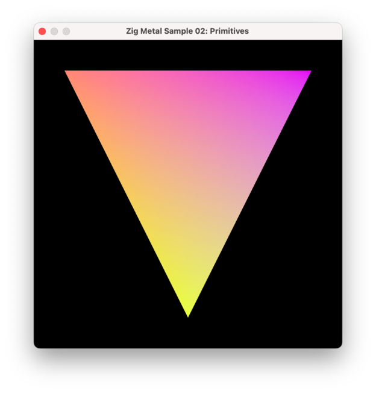
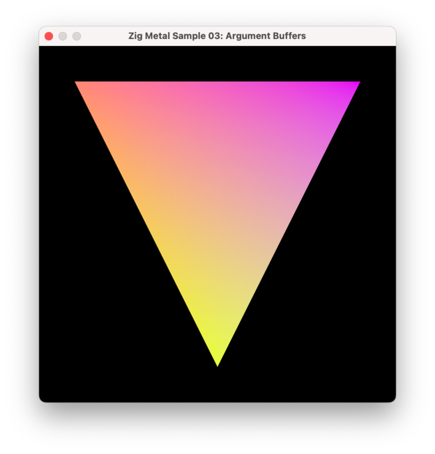
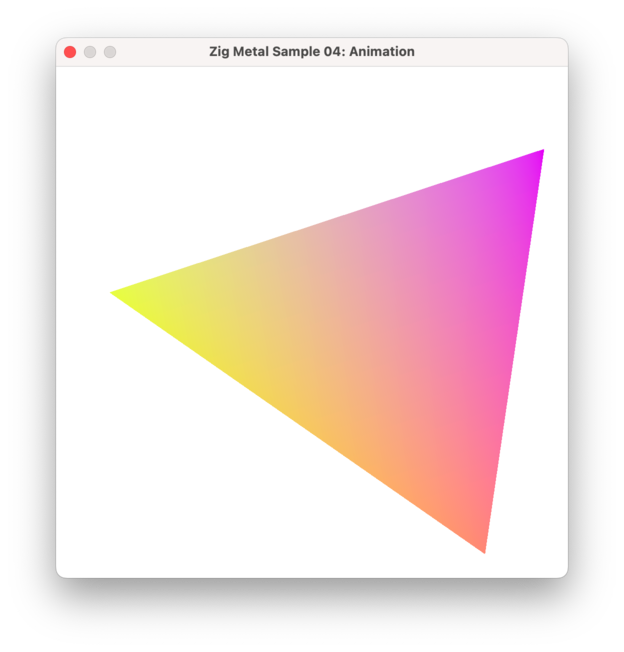
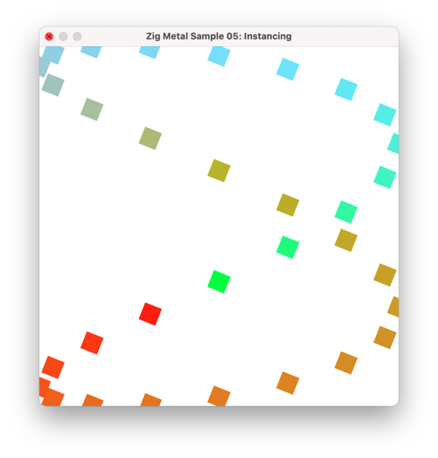
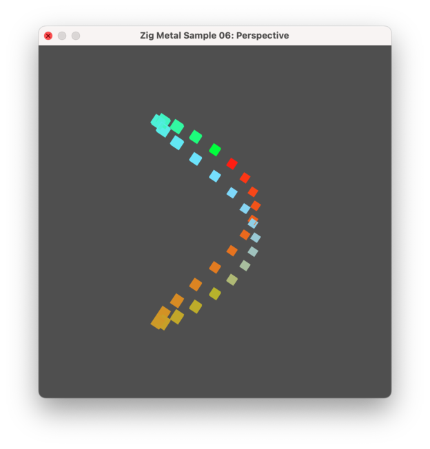
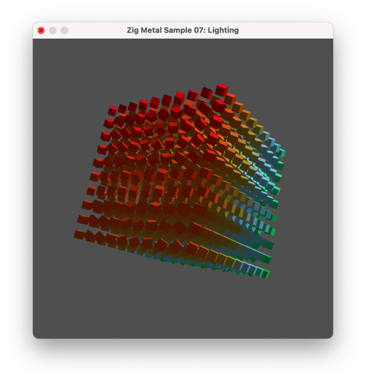
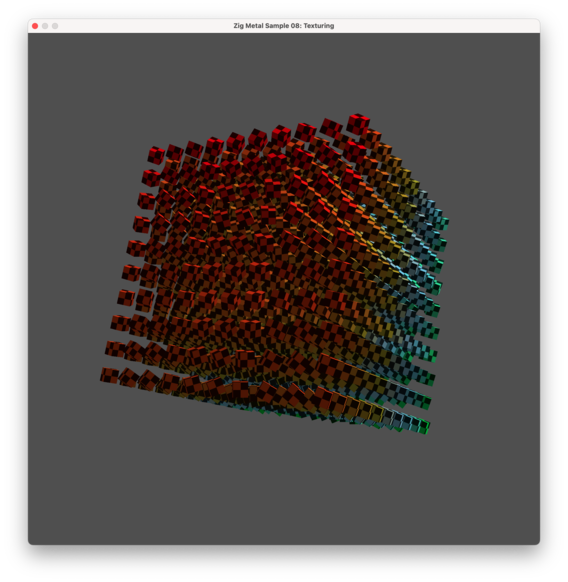
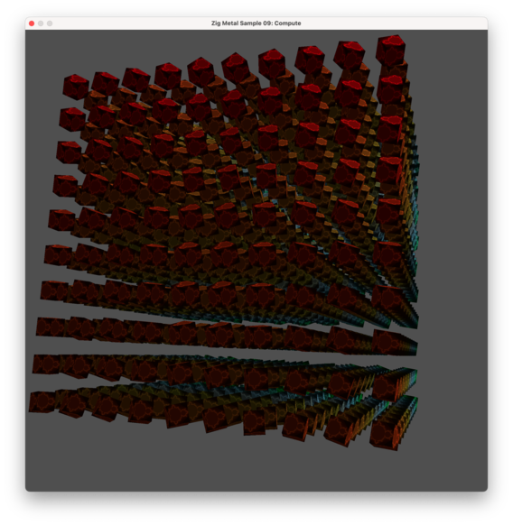
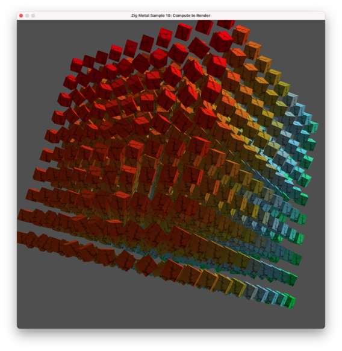

# zig-metal - Zig Bindings to the Metal API

This library is currently in alpha stage, don't use it in any serious projects!

Bindings are automatically generated using zig and libclang, but there are still
some issues with the code generation. The source code for the generator can be
found here: https://github.com/dmbfm/zig-metal-gen.

In the examples folder you can find a few samples which were directly
translated from apple's metal-cpp samples.

# Usage

Copy or clone `zig-metal` to a subdirectory of your project. For instance, if
you copy it to `libs/zig-metal` you should add this to your `build.zig`:

```zig 

const zig_metal = @import("libs/zig-metal/build.zig");

pub fn build(b: *std.Build) void {
    ...

    const zig_metal_pkg = zig_metal.package(b);
    zig_metal_pkg.link(exe);

    exe.linkFramework("Foundation");
    exe.linkFramework("Metal");
    exe.linkFramework("AppKit");    // If on macOS
    exe.linkFramework("MetalKit");  // If using MTKView
    ...
}

```

# What is included

All of the metal API and parts of the Foundation API which Metal depends on 
can are directly imported in the root zig-metal namespace, so you can access
them via `@import("zig-metal").MTLDevice, @import("zig-metal").NSString`, etc.

Additionally some basic AppKit bindings can be found in the `extras.appkit`
namespace, and basic MetalKit bindings in the `extras.metalkit` namespace.

# Examples

You can find some usage examples in the `examples` folder. These are
translations from Apple's samples for metal-cpp.

1. Window sample: `zig build run-window`



2. Primitive sample: `zig build run-primitive`



3. Argument Buffer sample: `zig build run-argbuffers`



4. Animation sample: `zig build run-animation`



5. Instancing sample: `zig build run-instancing`



6. Perspective sample: `zig build run-perspective`



7. Lighting sample: `zig build run-lighting`



8. Texturing sample: `zig build run-texturing`



9. Compute sample: `zig build run-compute`



10. Compute to render sample: `zig build run-compute-to-render`




